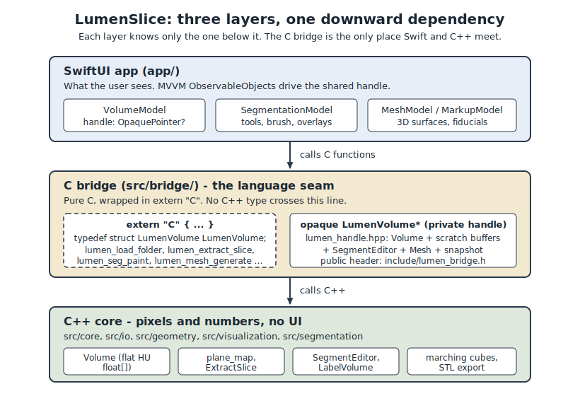
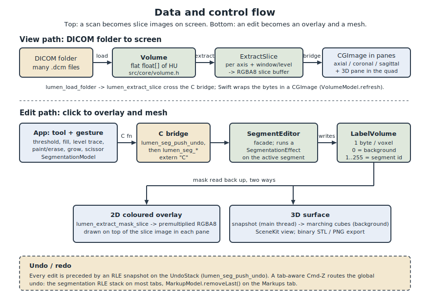

# Architecture overview: how data and control flow across the three layers

This document is a single, visual walkthrough of how LumenSlice is put together:
the three layers it is split into, and how a scan and the user's edits travel
through them. It complements the module map in
[`docs/engineering/ARCHITECTURE.md`](../engineering/ARCHITECTURE.md) and the pattern
catalogue in [`docs/engineering/DESIGN_PATTERNS.md`](../engineering/DESIGN_PATTERNS.md);
those explain each piece in isolation, while this doc follows the whole path
end to end and draws it.

## Why three layers

LumenSlice keeps pixel and number code strictly separate from user-interface code.
The core that reads DICOM, extracts slices, and edits masks knows nothing about
windows, gestures, or SwiftUI. The UI knows nothing about C++ types. That
separation is a deliberate rule (see `docs/agent.md` and
[`docs/engineering/ARCHITECTURE.md`](../engineering/ARCHITECTURE.md)), and it exists
so that either side can change without dragging the other along: the same C++ core
was built for a Sokol/ImGui shell and now drives a SwiftUI shell without a single
edit to the core (see the "Architecture note" in [`README.md`](../../README.md)).

The catch is that Swift cannot call C++ directly. So there is a thin middle layer,
a pure-C bridge, that both sides can speak. It is the only place the two worlds
meet. The result is three stacked layers with a strict downward dependency: each
layer knows only about the one below it.

```
  SwiftUI app  (app/)           ->  C bridge  (src/bridge/)  ->  C++ core  (src/core, ...)
  MVVM ObservableObjects            extern "C", one              pixels and numbers,
  drive the handle                  opaque LumenVolume*          no UI at all
```

## The layers, bottom to top

### 1. C++ core (pixels and numbers, no UI)

The core does the real work and holds no UI state. Its pieces live in a few folders:

- `src/core/` holds the data model. `lumen::Volume` (`src/core/volume.h`) is one
  flat, contiguous `float[]` of Hounsfield Units, laid out X-fastest then Y then Z,
  owned by a single `std::unique_ptr<float[]>`. There is no per-slice object; a
  "slice" is computed on demand by walking that buffer. `Volume::index(x,y,z)` is
  the linear-address formula, and `Axis` (Axial, Coronal, Sagittal) selects the
  stepping direction.
- `src/io/` reads a DICOM folder into a `Volume` and parses metadata.
- `src/geometry/` holds `plane_map`, the single place that maps a 2D slice pixel to
  a 3D voxel on each axis, including the coronal/sagittal vertical flip.
- `src/visualization/` turns a plane of HU into a windowed grayscale image
  (`ExtractSlice`) and colours mask overlays (`mask_view`).
- `src/segmentation/` holds everything about the label mask: `SegmentEditor` (the
  facade), the `LabelVolume` mask, the `SegmentTable` of segments, the `UndoStack`,
  the `SegmentationEffect` strategies, and marching cubes plus STL export.

### 2. C bridge (the language seam)

`src/bridge/` exposes a pure-C surface so Swift can `import LumenCore` and drive the
core. The public contract is `src/bridge/include/lumen_bridge.h`; read it top to
bottom and you have the entire app-to-core API. It is wrapped in
`extern "C"` so no C++ name mangling or C++ types leak across the line:

```c
#ifdef __cplusplus
extern "C" {
#endif
typedef struct LumenVolume LumenVolume;
...
#ifdef __cplusplus
}
#endif
```

Swift holds an opaque `LumenVolume*` and never sees the real struct. That concrete
struct is defined privately in `src/bridge/lumen_handle.hpp`, shared only among the
bridge's own translation units. It bundles the loaded scan plus everything derived
from it: `lumen::Volume volume`, reusable slice buffers (`scratch`, `mask_scratch`),
the `lumen::SegmentEditor editor` (which owns the mask, the segments, and the undo
history), the serialized metadata, and the 3D `mesh` with its snapshot. Splitting
the implementation into `lumen_bridge_volume.cpp`, `lumen_bridge_segment.cpp`, and
`lumen_bridge_mesh.cpp` keeps each translation unit to one concern; they all share
that one handle definition.

Every bridge function takes the handle and forwards to a C++ method. For example,
`lumen_extract_slice(v, axis, index, level, window, &w, &h)` returns a pointer into
an internal RGBA8 buffer, and `lumen_seg_paint(v, axis, index, cx, cy, radius, add)`
paints or erases a disk on the active segment. This is the Adapter pattern: plain C
in, C++ out.

### 3. SwiftUI app (what the user sees)

`app/` is the macOS front end, structured as MVVM. Three `ObservableObject` models
drive the same C++ handle, and SwiftUI views re-render when their `@Published`
values change:

- `VolumeModel` (`app/VolumeModel.swift`) owns the loaded volume handle, the three
  slice images, the shared crosshair `focus` voxel, window/level, and the overlay
  toggles. It is the only model that mutates the handle (load and free); the others
  read it.
- `SegmentationModel` (`app/Model/SegmentationModel.swift`) owns the segment list,
  the active segment, the tools and brush, the undo state, and the mask overlays.
- `MeshModel` (`app/ThreeD/MeshModel.swift`) owns the per-segment 3D surfaces.

`VolumeModel.handle` is an `OpaquePointer?`, Swift's view of the opaque
`LumenVolume*`. Because the models share one handle, `VolumeModel` is careful about
lifetime: a background mesh build reads the handle off the main actor, so a new load
that arrives mid-build does not free the old handle underneath it. `pinHandle()` and
`releaseHandle()` reference-count the readers, and a retired handle waits in
`deferredFree` until the last reader balances its pin.

The UI is split by tab. `app/Tabs/` has one controls file per tab (Threshold, Fill,
Level Trace, Paint/Erase, Refine, Grow, Scissor, Markups), `app/Viewer/` has the
slice panes and overlays, and `app/ThreeD/` has the SceneKit surface view.

## The extern "C" boundary, and why it matters

The bridge is the contract. Everything above it is Swift and knows nothing of C++;
everything below it is C++ and knows nothing of SwiftUI. The `extern "C"` wrapper
and the opaque handle are what make that possible: they present a flat, stable,
C-shaped surface that Swift's importer can consume, and they hide every C++ detail
behind a single pointer. If you want to know exactly what the UI can ask the core to
do, `lumen_bridge.h` is the complete and only answer.



## End to end: loading a scan and viewing it

The viewing path starts with a DICOM folder and ends with pixels in a pane.

1. The user opens a folder. `VolumeModel.load(path:)` parses it off the main thread
   (a real series can be hundreds of files) by calling `lumen_load_folder`, which
   the C++ loader in `src/io/` turns into one calibrated `lumen::Volume`. The opaque
   handle comes back as a bit pattern and is rebuilt into an `OpaquePointer` on the
   main actor in `finishLoad`.
2. `finishLoad` reads geometry through the bridge (`lumen_dims`, `lumen_spacing`,
   `lumen_hu_range`), picks a default window/level, centres the `focus` voxel, and
   calls `refreshAll()`.
3. For each axis, `VolumeModel.refresh(axis)` calls
   `lumen_extract_slice(handle, axis, sliceIndex, level, window, ...)`. The C++
   `ExtractSlice` walks the flat HU buffer for that plane, maps each voxel through
   the window/level transfer function, and fills an RGBA8 buffer. Swift copies those
   bytes out of the scratch buffer and wraps them in a `CGImage`.
4. The three `CGImage`s are published, and the axial, coronal, and sagittal panes
   redraw. The 4th pane in the quad shows the 3D surface.

Navigation reuses this path. The scroll wheel steps the slice index; right-drag
zooms per pane, cursor-anchored; the middle (scroll-wheel) button drags a pan;
Shift-hover does a linked cross-reference jump; a click locates a voxel. Crucially,
both rendering and hit-testing read one rectangle from `SliceCoordinates.fittedRect`
(zoom plus anchor plus pan), so a zoomed or panned pane still paints and picks the
correct voxel. The pixel-to-voxel maths itself is never duplicated in Swift: it
always goes through `lumen_slice_pixel_to_voxel` (and its inverse
`lumen_voxel_to_slice_pixel` for the crosshair), which sit on top of the one
`plane_map` in the core.

## End to end: an edit, from click to overlay and mesh

An edit follows the same three layers downward, then the result comes back up as an
overlay and, on demand, a surface.

1. The user picks a tool and acts on a slice. The tools present today are Threshold
   (Low/High sliders, Bone/Soft/Lung presets, and Otsu auto-threshold via
   `lumen_seg_otsu`), Fill (a tolerance flood, `lumen_seg_region_grow`), Level Trace
   (a slice-only iso-level flood, `lumen_seg_level_trace`), and a Paint/Erase brush
   (`lumen_seg_paint`). Refine adds keep-largest, remove-small islands, grow/shrink
   margin, and smooth. Grow from seeds runs a competitive grow-cut over the seeds'
   bounding box (`lumen_seg_grow_from_seeds`). The 3D scissor erases labelled voxels
   inside a screen-space lasso (`lumen_seg_scissor_cut`).
2. `SegmentationModel` first snapshots the mask for undo with `lumen_seg_push_undo`,
   so a whole paint drag or threshold session collapses into one undo step, then
   calls the matching bridge function.
3. The bridge forwards to `SegmentEditor` (the Facade). The editor runs the request
   as a `SegmentationEffect` (the Strategy pattern) against the active segment: the
   effect writes into the `LabelVolume` mask, which stores one byte per voxel
   (0 for background, 1..255 for a segment id).
4. The result flows back up two ways. For 2D, the app calls
   `lumen_extract_mask_slice`, which colours the mask for that plane into a
   premultiplied RGBA8 overlay (transparent where unlabelled or where the segment is
   hidden), matching the grayscale slice's dimensions and orientation. That overlay
   is drawn on top of the slice image. For 3D, the app snapshots the mask on the
   main thread (`lumen_mesh_snapshot` or `lumen_mesh_snapshot_label`), marches it
   into a triangle surface on a background thread (`lumen_mesh_generate`), and
   `MeshModel` shows the result in SceneKit. That work can also be written out as
   binary STL (`lumen_mesh_write_stl`) or exported as a PNG.

Undo and redo walk the RLE-compressed `UndoStack` (`lumen_seg_undo` /
`lumen_seg_redo`). A tab-aware Cmd-Z routes the global undo command by the active
workspace tab: on most tabs it pops the segmentation RLE stack, and on the Markups
tab it calls `MarkupModel.removeLast()` instead. Markups themselves (point, line,
and plane fiducials placed on 2D slices and shown in the 3D view) live in
`app/ThreeD/MarkupModel.swift` and are a Swift-side concern, separate from the C++
mask.



## Where to go next

- Module-by-module map and a "where do I fix X?" table:
  [`docs/engineering/ARCHITECTURE.md`](../engineering/ARCHITECTURE.md).
- The patterns named above (Facade, Strategy, Command/Memento, Adapter, single
  source of truth) with the reasoning behind each:
  [`docs/engineering/DESIGN_PATTERNS.md`](../engineering/DESIGN_PATTERNS.md), which
  also has the step-by-step recipe for adding a new segmentation tool.
