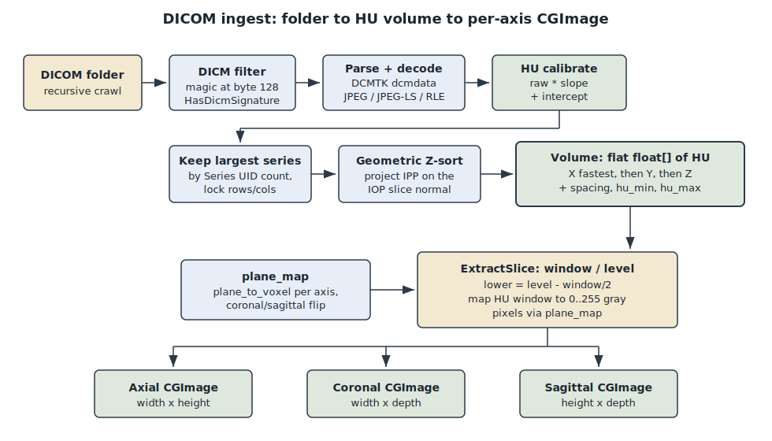

# DICOM ingest and the HU volume

This is the front door of LumenSlice. It turns a folder of DICOM files (the raw
output of a CT or MR scanner) into one contiguous block of numbers the rest of the
app can slice, window, segment, and render. Everything downstream - the tri-axis
viewer, the segmentation tools, the 3D surfaces - reads from the single volume this
subsystem builds.

Two ideas drive the whole design:

- A DICOM folder is messier than it looks. Files can be named arbitrarily, may be
  compressed, and often mix more than one acquisition together. Ingest exists to
  clean all of that up once, up front, so no later code has to.
- The pixels a scanner writes are not directly meaningful. Ingest calibrates them
  into Hounsfield Units (HU), a physical scale where air is about -1000, water is 0,
  and dense bone is well above +1000. Working in HU is what lets a "bone" or "soft
  tissue" window mean the same thing on any scan.

The output is a `Volume`: a flat `float[]` of HU values plus the geometry needed to
interpret it. It is the app's single source of truth for image data.

## Key components

### The ingest entry point

`LoadDicomFolder(const std::string& folder)` in `src/io/dicom_loader.cpp` (declared
in `src/io/dicom_loader.h`) does the entire job and never throws. It returns a
`LoadResult` that carries the built `Volume`, a human-readable `message`, counts
(`files_scanned`, `slices_loaded`, `files_skipped`), and the curated `StudyMeta` plus
the full list of `DicomTag`s. Failures are reported in `message` and the `ok` flag,
not by exceptions, because the caller is a background Swift task that just wants a
result or an explanation.

Internally each file becomes a private `Slice` struct: its HU pixels plus the few
tags needed to place and scale it (rows, cols, pixel spacing, Image Position Patient,
Image Orientation Patient, and the Series Instance UID that groups slices together).

### The pixel decoders

`EnsureCodecsRegistered()` registers DCMTK's JPEG, JPEG-LS, and RLE decoders exactly
once (guarded by a function-local static). This matters because most clinical PACS
exports store pixel data in an encapsulated (compressed) transfer syntax. Without the
decoders registered, every compressed slice would fail to parse and the load would
come up empty. LumenSlice depends only on DCMTK's `dcmdata` layer plus these decoder
modules; it does not use DCMTK for rendering.

### The HU volume

`Volume` lives in `src/core/volume.h`. It holds `width` (X, columns), `height` (Y,
rows), `depth` (Z, number of slices), per-axis `spacing_*` in millimetres, the HU
range `hu_min` / `hu_max`, and `voxel_buffer`, a `std::unique_ptr<float[]>` laid out
X fastest, then Y, then Z. `Volume::index(x, y, z)` computes the offset into that
buffer. There is no per-slice object: a "slice" is computed on demand by walking the
buffer along an axis. Keeping the data flat and contiguous is what makes slice
extraction and segmentation fast and simple.

### Slice geometry: plane_map

`src/geometry/plane_map.hpp` and `.cpp` are the single source of truth for how a 2D
pane pixel maps to a 3D voxel on each axis. `slice_dims(vol, axis)` gives the output
image size per plane, `plane_to_voxel(vol, axis, index, px, py)` maps a slice pixel
to its voxel, and `voxel_to_plane(...)` is the inverse. The coronal and sagittal
planes apply a vertical flip (`zf = depth - 1 - py`) so that superior anatomy renders
toward the top of the image. This mapping is deliberately in one file: rendering the
HU slice, drawing the mask overlay, painting onto a slice, and picking a voxel from a
click all call the same functions, so a zoomed or panned pane can never disagree with
itself about which voxel a pixel is.

### Window/level extraction

`ExtractSlice(vol, axis, index, level, window, out)` in
`src/visualization/slice_view.cpp` turns one plane of HU into a grayscale RGBA image.
It computes `lower = level - window/2`, then maps every HU value in the window onto
0..255 (clamped at the ends), writing gray + full alpha per pixel. It asks
`plane_map` for the output dimensions and the pixel-to-voxel mapping, so the flip and
the axis dimensions are never re-derived here. A window narrower than 1 HU is clamped
to 1 to avoid dividing by zero on a flat window.

### The Swift bridge model

`app/VolumeModel.swift` is the SwiftUI-side owner of the loaded volume. It holds the
opaque C handle, calls `lumen_load_folder` off the main thread (a real series can be
hundreds of files), and republishes the geometry, HU range, and metadata once the
load lands. Its `@Published var level` and `var window` are the window/level transfer
function; changing either calls `refresh(axis)`, which invokes `lumen_extract_slice`
through the bridge and wraps the returned RGBA bytes in a `CGImage` for each of the
three planes. `setWindowLevel(level:window:)` sets both with a single re-render so
presets and the drag-on-image gesture do not refresh twice.

## How it works, end to end

1. Crawl. `LoadDicomFolder` walks the folder recursively (skipping permission-denied
   entries) and keeps only regular files whose byte 128 carries the four-character
   `DICM` signature. `HasDicmSignature` is a cheap pre-filter so DCMTK's heavier
   parser is only handed plausible files.

2. Parse and decode each candidate. `ParseSlice` loads the dataset with DCMTK. If the
   pixel data uses an encapsulated (compressed) transfer syntax, it is decoded to
   native little-endian in place so the rest of the function sees plain pixels;
   anything that still cannot be decoded is skipped rather than read as garbage.
   Phase 1 handles 16-bit grayscale (CT and MR); other bit depths and truncated or
   multi-frame pixel data are skipped. Missing geometry tags fall back to sane
   defaults so a lone test slice still loads.

3. Calibrate to HU. Each 16-bit sample is reinterpreted per Pixel Representation
   (signed or unsigned), then calibrated with `hu = raw * RescaleSlope +
   RescaleIntercept`. Absent rescale tags default to slope 1 / intercept 0, leaving
   raw values untouched.

4. Pick one series. A folder often holds more than one acquisition (the CT plus a
   scout, a dose report, a secondary capture). Merging them would produce nonsensical
   spacing and Z-ordering, so ingest counts slices per Series Instance UID and keeps
   only the largest series. It then locks rows and columns to the first surviving
   slice and drops any that disagree, so the buffer is a clean rectangular block.

5. Sort in Z geometrically. File names are ignored. The slice normal is the cross
   product of the row and column direction cosines from Image Orientation (Patient);
   projecting each Image Position (Patient) onto that normal yields a true depth
   ordering. A degenerate orientation falls back to raw Z. Slices are sorted by that
   projected key.

6. Assemble the volume. `width`, `height`, and `depth` are set; in-plane spacing
   comes from Pixel Spacing (falling back to 1 mm isotropic if absent or zero, so
   aspect math stays well-defined); Z spacing comes from the gap between the first two
   sorted slice positions (falling back to the in-plane Y spacing for a single slice).
   The HU pixels are copied into the contiguous `voxel_buffer` while tracking `hu_min`
   and `hu_max`.

7. Attach metadata. `extract_study_meta` and `enumerate_tags` (in
   `src/io/dicom_meta.cpp`) read patient / study / series / equipment fields and the
   full top-level tag list from one representative slice, since those are identical
   across a series. A metadata failure is non-fatal: the volume still loads. On the
   Swift side, `serialize_meta_json` (also in `dicom_meta.cpp`) turns this into a JSON
   blob that `VolumeModel` reads through the bridge and parses.

8. Display. `VolumeModel.finishLoad` reads the geometry, HU range, and metadata, picks
   a starting window/level (the soft-tissue preset of level 40 / window 400 when the
   data spans it, otherwise the full HU range), centers the focus voxel, and calls
   `refreshAll()`. For each axis, `ExtractSlice` windows that plane of HU into a
   grayscale RGBA buffer, which becomes a `CGImage` shown in the corresponding pane.

The diagram below traces the same path from folder to the three per-axis images.

