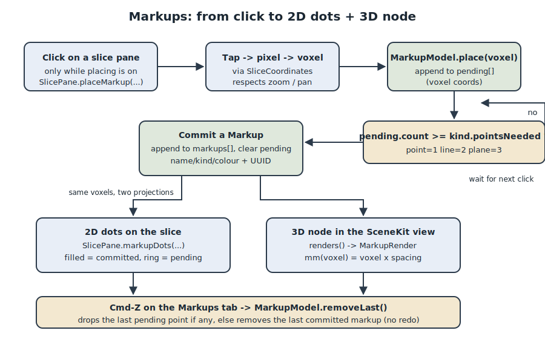

# Markups

Markups are fiducials the user drops on the 2D slice panes and sees echoed in the
3D view: a labelled point, a two-point line, or a three-point plane (drawn as a
triangle). They exist so a reader of a scan can annotate anatomy - mark a landmark,
measure across a structure, note a cutting plane - without touching the segmentation
mask. Markups are geometry laid on top of the volume, not edits to the volume, so
they live in their own model and their own undo path.

This document covers how a placement click accumulates points, when a `Markup`
commits, the per-markup metadata, how the same points render both as 2D dots on a
slice and as a 3D node, and how Cmd-Z on the Markups tab removes the last thing you
placed.

## Why a separate subsystem

The segmentation tools all edit one shared mask and undo through an RLE snapshot
stack (see `docs/engineering/DESIGN_PATTERNS.md`). Markups change nothing in that
mask. Mixing them into the same undo stack would be wrong in both directions:
undoing a paint stroke should not remove a landmark, and removing a landmark should
not roll back a mask edit. So markups get their own observable model,
`MarkupModel`, and their own one-step undo. The global Cmd-Z command routes to
whichever of the two is correct for the active tab.

Points are stored in **voxel coordinates**, which is the single source of truth for
position in the app. Everything else is derived from voxels: the 3D view multiplies
by voxel spacing to get millimetres, and the slice panes project voxels back to
pixels. Keeping one authoritative representation means a markup placed on the axial
pane shows up in the correct spot on the coronal and sagittal panes and in 3D,
because they all read the same voxel and convert it their own way.

## Key components

| Piece | Where | Responsibility |
|---|---|---|
| `MarkupModel` | `app/ThreeD/MarkupModel.swift` | Owns the markups, the pending points, and the placement state. The one place markup logic lives. |
| `MarkupModel.Kind` | `app/ThreeD/MarkupModel.swift` | The three kinds (`point`, `line`, `plane`) and how many points each needs (`pointsNeeded`). |
| `MarkupModel.Markup` | `app/ThreeD/MarkupModel.swift` | A committed fiducial: `kind`, `voxels`, `colorIndex`, `name`, plus a stable `id`. |
| `MarkupControls` | `app/Tabs/MarkupControls.swift` | The Markups-tab sidebar: pick a kind, toggle placement, list/rename/delete. |
| `SlicePane` | `app/Viewer/SlicePane.swift` | Turns a click into a voxel, calls `place`, and draws the 2D dots. |
| `LumenSliceApp` | `app/LumenSliceApp.swift` | Routes the global Cmd-Z to `MarkupModel.removeLast()` on the Markups tab. |

`MarkupModel` lives under `app/ThreeD/` rather than a markups folder because its
primary consumer is the 3D view (it produces `MarkupRender` values for SceneKit),
and the 2D dots are secondary.

## The three kinds

A kind is defined by how many points it takes, which is the only thing that decides
when a markup finishes:

| Kind | `pointsNeeded` | Rendered as |
|---|---|---|
| `point` | 1 | a sphere |
| `line` | 2 | a segment |
| `plane` | 3 | a triangle |

The user picks the kind with a segmented picker in `MarkupControls.typeSection`,
bound to `markup.kind`. `pointsNeeded` is the same number the sidebar shows as
progress ("2/3 points placed") and the same number `place` compares against to
decide when to commit.

## Per-markup metadata

A committed `Markup` carries:

- `id: UUID` - stable identity, so SwiftUI lists and the 3D diff can track a markup
  across renders even as its name changes.
- `kind: Kind` - point / line / plane.
- `voxels: [SIMD3<Int>]` - the defining points in voxel coordinates.
- `colorIndex: Int` - an index into `MarkupModel.palette`, a fixed set of eight
  bright colours (`yellow, cyan, green, orange, pink, purple, mint, red`) that is
  deliberately independent of the segment palette so markers do not blend into a
  mask. `color(_:)` resolves it with `palette[colorIndex % palette.count]`.
- `name: String` - a default like `"Line 2"` assigned from a running `counter`, and
  editable in the list. `rename(_:to:)` falls back to the kind title if you clear
  the field.

`counter` and `nextColor` both increment on every commit, so each new markup gets a
distinct default name and the next colour in the palette.

## How placement works, end to end

### 1. Turning placement on

The Markups tab shares the same 2x2 quad canvas as Visualize, so the three slice
panes and the 3D pane are all on screen while you place points. Placement is
explicit and off by default: nothing happens on a click until you flip the "Place
markups" toggle in `MarkupControls.placeSection`, which sets `markup.placing`. This
is deliberate - the same click on the Visualize tab means "locate here", and we do
not want a stray click to drop a fiducial.

### 2. A click becomes a voxel

When `placing` is on, `SliceInteraction` (in `app/Viewer/SlicePane.swift`) swaps the
pane's gesture to a `SpatialTapGesture` whose `onEnded` calls
`SlicePane.placeMarkup(at:container:)`. That method:

1. Converts the tap location to a slice pixel with `pixel(at:container:)`, which goes
   through `SliceCoordinates` and therefore respects the current zoom, anchor, and
   pan of that pane. A zoomed or panned pane still resolves the correct pixel because
   hit-testing reads the same fitted rect the image is drawn into.
2. Converts that pixel to a voxel with `model.voxel(onAxis:px:py:)`.
3. Calls `markup.place(voxel)`.

### 3. Pending points accumulate, then a markup commits

`MarkupModel.place(_:)` is the heart of the subsystem:

```swift
func place(_ voxel: SIMD3<Int>) {
    guard placing else { return }
    pending.append(voxel)
    if pending.count >= kind.pointsNeeded {
        markups.append(Markup(kind: kind, voxels: pending, colorIndex: nextColor,
                              name: "\(kind.title) \(counter)"))
        counter += 1
        nextColor += 1
        pending = []
    }
}
```

Each click appends to `pending`, the in-progress list. When `pending` has as many
points as the kind needs, a `Markup` is committed to `markups` and `pending` is
cleared, ready for the next one. A point commits on the first click; a line commits
on the second; a plane on the third. Between clicks of a multi-point markup, the
sidebar shows progress and offers a "Cancel point" button that calls
`cancelPending()` to discard the half-placed markup.

### 4. Two views of the same points

Committed points render in two places, both derived from the same voxels:

- **2D dots on the slice.** `SlicePane.markupDots(...)` iterates every markup's
  voxels and every pending voxel. `onCurrentSlice(_:axis:)` filters to the voxels
  that lie on the slice this pane is currently showing, so a dot only appears where
  its point actually is. Committed points draw as a filled coloured circle with a
  white outline; pending points draw as a hollow white ring, so an in-progress
  markup reads differently from a finished one. `markupPoint(...)` projects the voxel
  back to a display point through the same `SliceCoordinates` call the image uses, so
  dots track the image under zoom and pan.
- **A 3D node.** `renders()` maps each markup into a `MarkupRender`: its voxels
  converted to millimetres by `mm(_:)` (voxel times spacing, the same convention as
  the marching-cubes mesh), plus an `NSColor`. The 3D view consumes these to draw a
  sphere, segment, or triangle. `markerRadius` scales spheres to the physical size of
  the scan so they read at any volume. `pendingMM()` exposes the in-progress points
  the same way.

### 5. A fresh volume clears markups

In `init`, `MarkupModel` subscribes to `volume.$hasVolume`. Loading a new scan
resets `markups`, `pending`, and `placing`, because the old voxel coordinates no
longer map to the new volume. Markups are tied to the volume they were placed on.

## Cmd-Z on the Markups tab

Undo is a single global command in `LumenSliceApp`, routed by `selectedTab`
(`app/LumenSliceApp.swift`):

```swift
Button("Undo") {
    if selectedTab == .markups { markup.removeLast() }
    else { segmentation.undo() }
}
.keyboardShortcut("z", modifiers: .command)
.disabled(selectedTab == .markups
          ? !markup.canRemoveLast
          : !segmentation.canUndo)
```

On the Markups tab, Cmd-Z calls `MarkupModel.removeLast()`; on every other tab it
drives the segmentation RLE undo stack. This is why the model exists as a separate
undo path: the two never interfere.

`removeLast()` peels back exactly one placement action, mirroring the order they
happened:

```swift
func removeLast() {
    if !pending.isEmpty { pending.removeLast() }
    else if !markups.isEmpty { markups.removeLast() }
}
```

If you are partway through a line or plane, Cmd-Z drops the last pending point.
Otherwise it removes the most recently committed markup. `canRemoveLast`
(`!pending.isEmpty || !markups.isEmpty`) gates the menu item so it greys out when
there is nothing to undo. There is no redo for markups - the Redo command is
disabled on the Markups tab - because markup undo is a simple one-step "take back the
last thing", not a full snapshot history.

## Flow diagram


