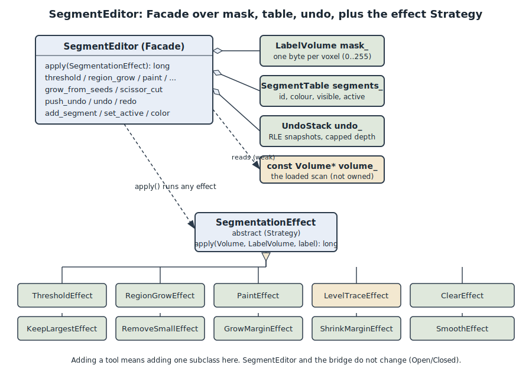
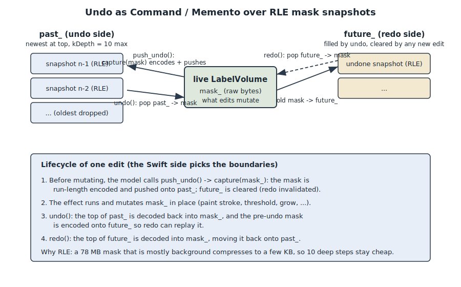

# Segmentation

Segmentation is how LumenSlice turns a stack of grayscale CT slices into labelled
regions: bone, a tumour, a lung, an organ. The user paints or grows a mask over the
scan, and that mask drives the coloured overlay on the slice panes and the 3D surfaces
in the quad view. This doc covers the whole feature set the user sees, and the object
design underneath it, so a newcomer can find where any tool lives and why the pieces
are shaped the way they are.

The design goal is a small, testable core with one clear owner. All the pixel work
happens in C++ with no UI and no threading; the SwiftUI app decides *when* to run each
operation and how to present it. Every edit flows through a single object,
`SegmentEditor`, which keeps the mask, the segment metadata, and the undo history
consistent so no caller can forget an invariant.

## What a segmentation is made of

A segmentation of one volume is three things kept together:

1. **The mask** - `LabelVolume` (`src/segmentation/label_volume.hpp`). One byte per
   voxel, laid out identically to the HU buffer (X fastest, then Y, then Z), so a
   voxel's mask byte sits at the same linear index as its HU value. `0` is background;
   `1..255` are segment ids. This is the actual painted data.

2. **The segment table** - `SegmentTable` (`src/segmentation/segment_table.hpp`). The
   per-id metadata: colour, a visibility flag, and which id is *active* (the target of
   edits). It keeps two parallel representations on purpose: an ordered list for the UI
   to iterate, and a 256-entry colour/visibility lookup table indexed by id, so the
   overlay renderer and marching cubes can read a voxel's colour in O(1) instead of
   searching a list per voxel. Segment *names* live only on the Swift side; the core
   needs colour and visibility, not names.

3. **The undo history** - `UndoStack` (`src/segmentation/undo_stack.hpp`). A bounded
   stack of run-length-encoded mask snapshots (details below).

## SegmentEditor: the facade

`SegmentEditor` (`src/segmentation/segment_editor.hpp`) is the single object that
"owns the segmentation of one volume." It holds the three pieces above as private
members plus a non-owning `const Volume*` to the loaded scan, so editing methods can
read HU values without the caller passing the volume in every time.

Why a facade. Before this class existed, the C bridge itself carried domain rules like
"removing a segment must also clear its voxels." That mixed two jobs: marshalling
between languages and editing masks. `SegmentEditor` pulls all the editing rules into
one place, so the bridge becomes a thin translator, invariants live in exactly one
spot (the mask, table, and undo stack are `private`), and the rest of the app talks to
one object instead of three. `remove_segment` is the clearest example: it clears the
removed id's voxels from the mask *and then* forgets the metadata, an invariant a
caller could never accidentally skip (`src/segmentation/segment_editor.cpp`).

Every editing operation runs through one method:

```cpp
long SegmentEditor::apply(const SegmentationEffect& effect) {
    if (volume_ == nullptr) return 0;
    return effect.apply(*volume_, mask_, segments_.active());
}
```

The editor never branches on "which operation is this?" It builds the right effect in
a small convenience method (`threshold`, `region_grow`, `paint`, `level_trace`,
`keep_largest`, `grow_margin`, `smooth`, ...) and hands it to `apply()`. Two
operations that are not simple mask kernels, `grow_from_seeds` and `scissor_cut`,
delegate to their own free functions rather than effect classes, because both need the
volume and extra geometry that do not fit the uniform effect shape.

## SegmentationEffect: the Strategy

A "segmentation effect" is one editing operation. Each is a small class deriving from
`SegmentationEffect` (`src/segmentation/effects.hpp`) and overriding one method:

```cpp
class SegmentationEffect {
public:
    virtual ~SegmentationEffect() = default;
    [[nodiscard]] virtual long apply(const Volume& volume, LabelVolume& mask,
                                     std::uint8_t label) const = 0;
};
```

Because every effect shares that interface, `SegmentEditor::apply` runs any of them
through one call without knowing which concrete effect it holds. That is the Strategy
pattern: interchangeable algorithms behind one interface. Each effect holds its own
parameters as private fields (a `ThresholdEffect` carries its `low_`/`high_`), and
`apply()` returns the number of voxels changed so callers can decide whether a redraw
is needed.

The concrete effects today are `ThresholdEffect`, `RegionGrowEffect`, `PaintEffect`,
`ClearEffect`, `KeepLargestEffect`, `RemoveSmallEffect`, `GrowMarginEffect`,
`ShrinkMarginEffect`, `SmoothEffect`, and `LevelTraceEffect`. Each one is a thin
adapter: its `apply()` delegates to a pure free function in `segment.hpp` /
`analysis.hpp` (`threshold_fill`, `region_grow`, `paint_disk`, `level_trace`,
`dilate_label`, `smooth_label`, and so on). That split is deliberate. The heavy
numeric work is stateless math, trivially unit-testable in isolation; the effect
classes are the object-oriented surface that holds the parameters and presents the
uniform, extensible contract.

Why this shape. Adding a tool means adding a new subclass here, not editing the editor
or the bridge. Existing code stays closed for modification and open for extension
(Open/Closed). The step-by-step recipe for adding an effect is in
`docs/engineering/DESIGN_PATTERNS.md`.



## The tools

The Swift side exposes these through the Segment tab (`app/Tabs/SegmentControls.swift`)
and `SegmentationModel` (`app/Model/SegmentationModel.swift`). The active tool is a
`SegTool` enum: `threshold`, `regionGrow` (shown as "Fill"), `levelTrace`, `paint`,
`erase`.

### Threshold

`ThresholdEffect` re-fills the active segment from a HU window. Every background-or-own
voxel with `lo <= HU <= hi` becomes the active label, and any of the segment's own
voxels now out of range are cleared. Voxels owned by *other* segments are left
untouched, so thresholding one segment never steals from another
(`threshold_fill` in `src/segmentation/segment.cpp`).

In the UI, threshold has Low and High sliders plus three presets - Bone (300..3000),
Soft (40..80), Lung (-900..-400) - and an Otsu auto-threshold button. Threshold is
live: the two sliders feed a debounced Combine pipeline (180 ms) so dragging does not
recompute the whole-volume mask on every tick. Otsu's method (`otsu_threshold` in
`src/segmentation/analysis.hpp`) picks the HU that maximises between-class variance
over the histogram; the UI applies it as `[otsu, hu_max]` and skips the redundant
debounced pass it would otherwise trigger.

### Fill (region grow)

`RegionGrowEffect` is a 6-connected flood fill. From a seed voxel it claims connected
*background* voxels whose HU is within a tolerance of the seed's HU, stopping at any
already-labelled voxel (`region_grow` in `src/segmentation/segment.cpp`). The mask
itself doubles as the visited set - a voxel is labelled the moment it is enqueued, so
it can never be revisited - which bounds the whole fill at the voxel count. In the UI
this is the "Fill" tool: click a structure on any slice, adjust the tolerance slider,
and each click floods. It is a per-click fill, not the seed brush for Grow from seeds.

### Level Trace

`LevelTraceEffect` traces a bright structure on a single slice. From the clicked pixel
it floods the 4-connected region of pixels whose HU is at or above the clicked pixel's
HU (its iso-level), out to where the image drops below that level, and adds them to the
active segment (`level_trace` in `src/segmentation/segment.cpp`). It is 2D by design:
it works on the clicked slice only, and it stops at voxels owned by another segment.
This gives "select a whole bright structure with one click" without the depth spread of
a 3D fill. Each slice pixel maps through `plane_map` so the coronal/sagittal vertical
flip is honoured.

### Paint and Erase

`PaintEffect` stamps a filled disk on one slice plane. The disk is defined in the 2D
output-pixel space of the axis/index (radius in pixels) and mapped back to voxels via
`plane_map`. Paint overwrites whatever was there (the brush wins); erase clears only
voxels that currently carry the active label, so erasing one segment cannot rub out
another (`paint_disk` in `src/segmentation/segment.cpp`). The brush has a radius slider
(1..80 slice pixels).

A drag is turned into a smooth stroke on the Swift side: `paintStroke` steps disks from
the previous brush point to the current one, spaced at half the radius so fast drags
leave no gaps. During the drag only the painted plane's overlay is re-extracted, and
that live rebuild is throttled to display rate; the exact refresh of all planes happens
once on stroke end. That split is what keeps brushing fluid on a large scan.

### Refine: islands, margin, smooth

These operate purely on the mask (they ignore the volume) and back the "Refine" and
island-cleanup controls:

- **Keep largest** (`KeepLargestEffect` -> `keep_largest_island`) keeps only the
  largest 6-connected component of the active label and clears the rest.
- **Remove small** (`RemoveSmallEffect` -> `remove_small_islands`) drops every
  component smaller than a voxel cutoff.
- **Grow / shrink margin** (`GrowMarginEffect` / `ShrinkMarginEffect` ->
  `dilate_label` / `erode_label`) dilate or erode the label by voxel layers. Dilation
  claims only background, never another segment.
- **Smooth** (`SmoothEffect` -> `smooth_label`) runs a 26-neighbour majority filter
  that rounds off jagged paint and fills pinholes, claiming only background and
  clearing only the active label.

### Grow from seeds (grow-cut)

`grow_from_seeds` (`src/segmentation/grow_from_seeds.hpp`) is competitive region growing
from multi-label seeds - the grow-cut automaton of Vezhnevets and Konouchine. You paint
seed strokes for two or more segments (typically the structure plus a background), then
click Grow. Each voxel has an owning label and a strength in `[0,1]`; on each pass a
voxel can be conquered by a neighbour whose attack (neighbour strength times HU
similarity) beats the voxel's own strength. Seed voxels start at full strength and are
never overwritten, so the strokes you painted are preserved.

Two scope limits keep it tractable on large scans: it runs only inside the bounding box
of the seeds (expanded by a margin), and it is capped at a maximum number of Jacobi
passes (the UI's Iterations slider). The tab gates the button exactly like 3D Slicer:
at least two segments must carry seed voxels before Grow is enabled, because grow-cut
partitions the region *between* seeds and needs something to grow against. Growth only
happens on the button click; nothing grows while you paint.

### 3D scissor

`scissor_cut` (`src/segmentation/scissor.hpp`) cuts the segmentation with a screen-space
lasso drawn over the 3D surface. Every labelled voxel that projects inside the outline
(through the full depth) is erased; passing `erase_inside = false` erases outside
instead. The projection runs in the core, per labelled voxel, because doing it in Swift
would mean marshalling millions of points across the bridge. The caller supplies the
combined view-projection matrix SceneKit is using (16 floats, row-major) and the lasso
polygon in the same top-left-origin, y-down pixel space the overlay is captured in;
keeping both in one space is what makes the cut line up with what is drawn. `only_label`
can limit the cut to one segment, or `0` cuts every labelled voxel.

## Undo and redo

Undo is a Command/Memento over mask snapshots. `UndoStack`
(`src/segmentation/undo_stack.hpp`) keeps two deques of snapshots, `past_` and
`future_`. `capture()` saves the current mask before an edit; `undo()` restores the most
recent snapshot and moves the current state onto the redo side; `redo()` reverses that.

The twist is memory. A full mask can be tens of megabytes (a 512x512x300 mask is 78 MB
raw), so each snapshot is run-length encoded before it is stored - a mask that is mostly
background compresses to a few kilobytes - and the history is capped at `kDepth = 10`
per side, dropping the oldest. That keeps undo bounded no matter how long the session
runs. RLE is effectively the diff against an all-background baseline, which is what mask
history looks like in practice.

The Swift side decides the boundaries so an undo step matches a user action.
`SegmentationModel` calls `push_undo` at the start of each operation - a paint stroke, a
Fill click, a level-trace click, a threshold session, an islands cleanup, a grow, a
scissor cut - so a whole drag or a run of live-threshold ticks collapses into a single
undo entry. A run of threshold edits is coalesced with a `thresholdNeedsUndoCapture`
flag, and operations that changed nothing roll back their intent by refreshing the undo
state instead of leaving an empty entry.



The same undo stack is reached two ways. On most tabs Cmd-Z routes to this RLE stack; on
the Markups tab it routes to `MarkupModel.removeLast()` instead. That routing is the
tab-aware global undo command described in the architecture docs; from this subsystem's
point of view, undo/redo are just `SegmentEditor::undo()` / `redo()` over the snapshots.

## How it fits together end to end

1. A DICOM folder loads into a `Volume`. `SegmentEditor::reset_to` sizes the mask to it,
   clears the history, and creates one active segment.
2. The user picks a tool in the Segment tab. `SegmentationModel` captures an undo
   snapshot, then calls the matching bridge function.
3. The bridge (`src/bridge/`, plain C over the opaque `LumenVolume*` handle) forwards to
   the `SegmentEditor` convenience method, which builds the effect and runs `apply()`
   (or delegates to grow-cut / scissor).
4. The effect mutates the mask and returns the voxels changed.
5. `SegmentationModel` re-extracts the coloured overlay images (one per plane, in a
   separate `OverlayStore` so painting stays fluid) and refreshes the per-segment voxel
   counts and undo/redo availability.
6. The 3D tab meshes each visible segment separately (marching cubes over a snapshot of
   the mask) for the surface panes and STL export.

The dependency direction is strict: the app depends on the bridge, the bridge depends on
`SegmentEditor`, and `SegmentEditor` depends only on the pure-compute core. No UI or
marshalling concern leaks into the segmentation classes, which is what keeps the core
small and testable. For the broader layering and the other patterns in play, see
`docs/engineering/ARCHITECTURE.md` and `docs/engineering/DESIGN_PATTERNS.md`.
