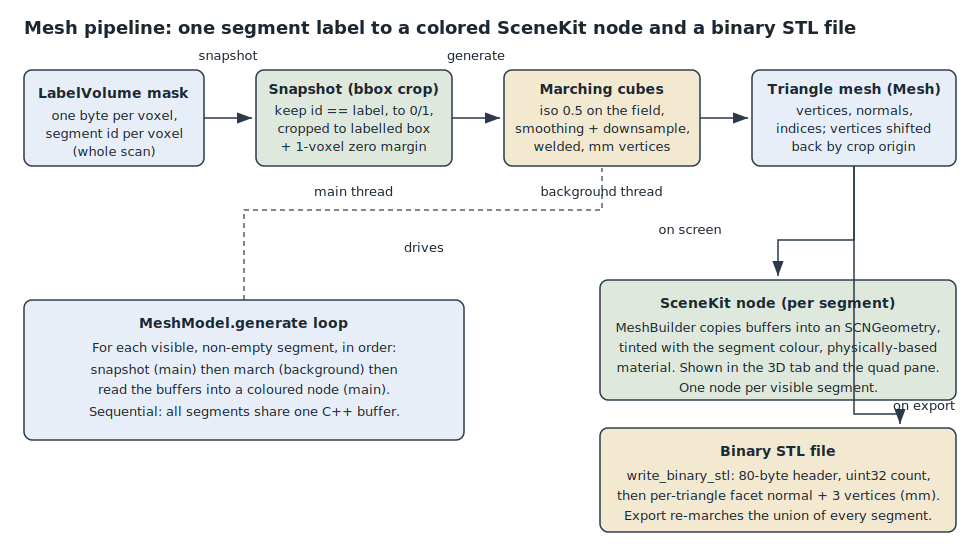

# 3D surfacing and export

This subsystem turns the segmentation mask into a viewable 3D surface and into
files you can take out of the app. It exists because a stack of labelled 2D
slices is hard to reason about as a shape: once you have segmented a structure,
you want to see it as a solid, orbit around it, and hand it to a printer or
another tool. So the app builds a triangle surface per segment (marching cubes),
draws it with SceneKit, and can write the result out as a binary STL. It also
exports the current axial slice as a PNG for quick sharing.

Everything here follows the app's three-layer split. The surface is computed in
the C++ core (pixels and numbers only), reached through the pure-C bridge, and
rendered by the SwiftUI app. No layer reaches across that boundary: the core
never knows about SceneKit, and Swift never touches a C++ type directly.

## The pieces

### Marching cubes (C++ core)

`src/segmentation/marching_cubes.hpp` / `.cpp` hold the surfacing algorithm and
the `Mesh` struct it fills:

- `Mesh` (in `marching_cubes.hpp`) is three flat `std::vector`s: `vertices`
  (3 floats each, in millimetres), `normals` (3 floats each, unit length), and
  `indices` (3 per triangle). It exposes `vertex_count()` and
  `triangle_count()`.
- `marching_cubes(mask, w, h, d, spacing_x, spacing_y, spacing_z, smooth_iters,
  downsample, out)` runs the classic Lorensen marching-cubes tables over the
  mask, treating it as a 0/1 scalar field at isolevel `kIso = 0.5`, and replaces
  `out`. It returns the triangle count.

A few decisions in the `.cpp` are worth calling out, because they are the reason
the surface looks and behaves the way it does:

- `build_field` first samples the mask onto a (possibly coarser) 0/1 grid.
  `downsample` (>= 1) picks every Nth voxel so large masks do not explode into
  millions of triangles, and `smooth_iters` runs a light 6-neighbour blur on the
  field to soften the voxel stair-steps before the surface is extracted.
- Vertices are emitted in physical millimetres using the volume spacing
  (`step_x = ds * spacing_x`, and so on), not in voxel indices, so the exported
  shape is the real anatomical size.
- Vertices are welded by edge identity through an `edge_to_vertex` map keyed on
  the unordered pair of field-grid corner indices. A vertex shared between
  neighbouring cells is emitted once, which gives a proper indexed mesh and lets
  per-vertex normals be smooth rather than faceted.
- Triangle winding is deliberately reversed (the last two indices of each
  triangle are swapped). With "inside" defined as field `>= iso`, the raw table
  order faces normals inward; swapping fixes both the welded vertex normals and,
  later, the STL facet normals so the surface faces outward.
- Per-vertex normals are accumulated from each triangle's geometric normal and
  then normalized, so shading is smooth across welded vertices.

### Binary STL export (C++ core)

`src/segmentation/stl_export.hpp` / `.cpp` write a `Mesh` to disk.
`write_binary_stl(mesh, path)` produces a standard binary STL: an 80-byte header
(labelled `"LumenSlice binary STL"`), a `uint32` triangle count, then per
triangle a facet normal, the three vertices, and a `uint16` attribute count of
zero. The file is `84 + 50 * triangles` bytes. Coordinates are written in mm
exactly as the mesh holds them. The facet normal is recomputed from the triangle
here rather than reused from the vertex normals, since STL stores a per-triangle
normal. macOS/arm64 is little-endian, which matches the STL byte order, so
values are written directly. It returns 0 on success or a non-zero errno-style
code (the open failure's `errno`, or `EIO` on a short write).

### The bridge (pure C)

`src/bridge/lumen_bridge_mesh.cpp` is the mesh translation unit of the C bridge.
It reads the editor's mask through a const view and never mutates the
segmentation. The handle (`LumenVolume` in `src/bridge/lumen_handle.hpp`) owns
the one `lumen::Mesh mesh`, a `mesh_snapshot` byte buffer, the snapshot
dimensions (`snap_w/h/d`), and the snapshot origin within the full volume
(`snap_ox/oy/oz`).

The important design choice lives in `crop_snapshot`: rather than march the whole
scan, it makes one linear pass to find the inclusive bounding box of the voxels
it is keeping, then copies just that box (plus a one-voxel zero margin so the
field has a border and marching cubes can close the surface at the box edges)
into `mesh_snapshot`, binarized to 0/1. This is what makes 3D generation scale
with what was segmented, not with the loaded scan size. The crop origin is
recorded so vertices can be shifted back into full-volume space afterwards.

The exported C functions are:

- `lumen_mesh_snapshot(v)` snapshots every labelled voxel (id != 0). Used for
  export, where the whole segmentation should become one surface.
- `lumen_mesh_snapshot_label(v, id)` snapshots only voxels of one segment id.
  Used for the on-screen per-segment surfaces.
- `lumen_mesh_generate(v, smooth_iters, downsample)` runs `marching_cubes` on the
  current snapshot and, if the crop origin is non-zero, translates every vertex
  back by the crop origin (a whole-voxel shift in mm, independent of the
  downsample factor). Returns the triangle count.
- `lumen_mesh_vertex_count`, `lumen_mesh_index_count`, `lumen_mesh_vertices`,
  `lumen_mesh_normals`, `lumen_mesh_indices` expose the finished buffers to
  Swift without copying (the pointers stay valid until the next generate).
- `lumen_mesh_write_stl(v, path)` calls `write_binary_stl` on the current mesh.

The split into a main-thread snapshot and a background-thread generate is
intentional: it lets the heavy march run off the main thread while the user keeps
editing, without the march reading a mask that is changing underneath it.

### SceneKit geometry (`app/ThreeD/MeshBuilder.swift`)

`MeshBuilder.geometry(from: handle, color:)` turns the bridge's mesh buffers into
an `SCNGeometry`. It reads the vertex/normal/index pointers and copies each block
once into `SCNGeometrySource`s and an `SCNGeometryElement` (SceneKit needs to own
its data; the bridge buffers are only valid until the next generate). The
material is physically-based, tinted with the segment colour, roughness 0.55, and
double-sided so thin structures read from either face. It returns `nil` when the
mesh is empty.

### Mesh model (`app/ThreeD/MeshModel.swift`)

`MeshModel` is the `ObservableObject` that drives generation and holds one
coloured `SCNGeometry` per visible segment. It publishes `smoothing`,
`downsample`, `scissorActive`, `isGenerating`, `triangleCount`, `vertexCount`,
and `geometries` so the views can react. When a new volume loads, it clears any
existing surfaces.

`generate()` captures the visible, non-empty segments up front on the main actor
as plain `SegmentSpec` value types (id plus colour components), so only Sendable
values cross into the background task. It pins the volume handle first, so
loading a new volume mid-generation defers the free rather than pulling the
buffer out from under the march (a use-after-free guard). Then, on a detached
task, it walks the segments one at a time: snapshot that segment's label on the
main actor, march on the background thread, then hop back to the main actor to
copy the buffers into a coloured node before the next segment overwrites the
shared buffer. Segments are processed sequentially precisely because they all
write the one C++ mesh buffer in the handle.

`finishGenerate` runs on the main actor and, before publishing, checks the handle
has not been swapped while the march ran. If it has, the mesh belongs to a
now-replaced volume and is discarded rather than shown over the new one.

`exportSTL(to:)` is separate from the on-screen surfaces. It refuses to run while
a background generate is in flight (both write the shared buffer, so overlapping
would tear the file), snapshots every labelled voxel, regenerates the combined
surface into the buffer, and writes the STL. The per-segment geometries on screen
are untouched.

### The 3D view (`app/ThreeD/MeshSceneView.swift`)

`MeshSceneView` is the `NSViewRepresentable` SceneKit viewport. It uses SceneKit's
built-in camera control for orbit / zoom / pan, an explicit camera with wide clip
planes (millimetre-scale meshes would otherwise flicker on zoom against the
default clip range), and default lighting. Each visible segment becomes its own
node named `"mesh"`; a small R/A/S axis gnomon at the volume origin gives
anatomical orientation (red X, green Y, blue Z). The view rebuilds its nodes only
when the geometry set actually changes, so orbiting does not yank the camera or
rebuild the scene, and it frames the camera to the meshes when they change.

The same view also draws markups (point / line / plane fiducials from
`MarkupModel`) alongside the surface, and hosts a transparent `LassoOverlayView`
for the 3D scissor. The overlay's `hitTest` returns `nil` when scissor mode is
off, so mouse events pass straight through to the camera; when on, it captures
the freehand loop and, via the coordinator, hands the parent a row-major
view*projection matrix, the viewport size, and the outline for the bridge to cut
the mask. `MeshCanvas` in the same file is the central canvas shared by the 3D
and Export tabs, showing the viewport or an empty / generating placeholder.

### The 3D pane in the quad (`app/Viewer/ThreeDPane.swift`)

`ThreeDPane` is the fourth pane in the slice workspace quad, sitting alongside the
axial / coronal / sagittal planes. It wraps the same `MeshSceneView` the
dedicated 3D tab uses (full orbit / zoom / pan) and adds an inline
Generate / Update button so you can build a surface from the current segments
without leaving the slice view. Its chrome mirrors `SlicePane` so it reads as a
peer of the slice panes, a header button maximizes it to fill the viewport, and a
scissors button toggles the same 3D scissor once a surface exists.

### The tab controls

`app/Tabs/ThreeDControls.swift` is the 3D tab's control panel: a Smoothing
stepper (0 to 5), a Resolution picker (Full / Half / Third, mapping to downsample
1 / 2 / 3), the primary Generate / Update button, live triangle and vertex
counts, and a Scissor-mode toggle once a surface exists. `app/Tabs/ExportControls.swift`
is the Export tab: an Export STL button (enabled only when a mesh exists and no
generate is running) and an Export axial PNG button. The PNG path is
Swift-side only: it takes the current axial `CGImage` from the volume model,
wraps it in an `NSBitmapImageRep`, and writes PNG data, so it does not touch the
mesh pipeline at all.

## How it works end to end

Building the on-screen surface:

1. In the 3D tab (or the inline button on the 3D pane), you press Generate.
   `MeshModel.generate()` snapshots the visible, non-empty segments as value
   specs and pins the handle.
2. For each segment in turn, `lumen_mesh_snapshot_label` crops that segment's
   voxels to their bounding box on the main thread, `lumen_mesh_generate` marches
   the snapshot on a background thread and shifts vertices back by the crop
   origin, and `MeshBuilder.geometry` copies the result into a coloured
   `SCNGeometry` back on the main actor.
3. `finishGenerate` publishes the array of geometries (one per segment), and
   `MeshSceneView` builds one node per geometry, frames the camera, and shows the
   surfaces in both the 3D tab and the quad pane.

Exporting:

- STL: `MeshModel.exportSTL(to:)` snapshots every labelled voxel with
  `lumen_mesh_snapshot`, regenerates the combined surface, and calls
  `lumen_mesh_write_stl`, which runs `write_binary_stl`. The union of all
  segments is written as one binary STL in millimetres.
- PNG: `ExportControls.exportAxialPNG()` writes the current axial slice image
  straight to a PNG file, independent of the 3D surface.

The diagram below traces one segment from the label mask to a coloured SceneKit
node and, on export, to the STL file.

