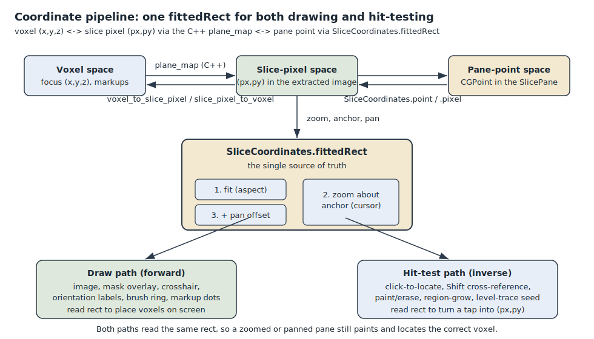
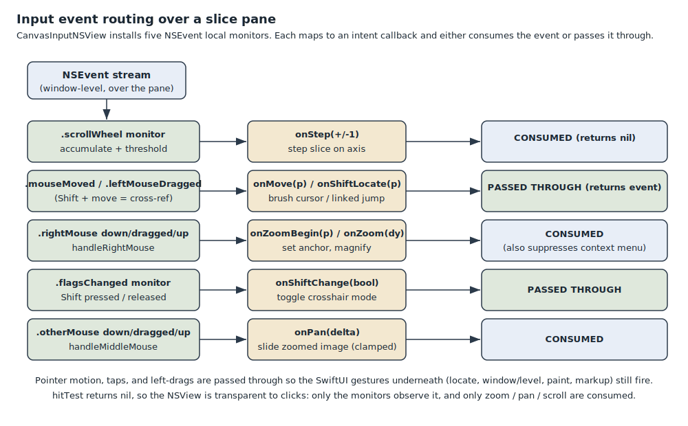

# Viewer navigation

This doc covers the tri-axis slice viewer and every navigation gesture it
supports: scrolling through slices, cursor-anchored zoom, pan, Shift
cross-reference, click-to-locate, the crosshair, and the orientation labels. It
explains the one idea that holds all of this together: a single rect,
`SliceCoordinates.fittedRect`, that both the drawing code and the hit-testing
code read. Get that rect right once and a zoomed or panned pane still paints and
locates the correct voxel; get it wrong in one place and the two silently
disagree.

## What this subsystem is, and why it exists

A CT volume is a 3D grid of voxels. The viewer shows it as three orthogonal 2D
planes - axial, coronal, sagittal - plus a 3D surface pane, laid out as a 2x2
quad (`app/Viewer/SliceBoard.swift`). Each plane is a slice image extracted by
the C++ core and handed to SwiftUI as a `CGImage`. Navigation is the set of
gestures that let a user move the shared focus point through the volume and
change how each plane is framed on screen.

The hard part is not any single gesture; it is keeping two directions of
coordinate math in agreement:

- **Forward (draw):** a voxel, or a slice pixel, has to land at the right point
  on screen - for the image itself, the mask overlay, the crosshair, the
  orientation letters, the brush ring, and the markup dots.
- **Inverse (hit-test):** a click or hover point on screen has to resolve back to
  the slice pixel and voxel the user meant, so seeding, painting, and locating
  act on what is under the cursor.

If the pane is zoomed to 4x and panned off-centre, both directions have to apply
the exact same fit, zoom, and pan. The subsystem exists to make that impossible
to get subtly wrong, by routing every one of those readers through a single pure
function.

## Key components

### The shared model: `VolumeModel`

`app/VolumeModel.swift` is the observable bridge to the C++ core. It owns the
loaded volume handle and the three published slice images (`images`). The single
piece of navigation state is `focus`, a voxel `SIMD3<Int>` that all three planes
pass through. Per-axis slice indices are derived from it (`sliceIndex`: axial
steps Z, coronal steps Y, sagittal steps X), so there is one source of truth for
"where are we in the volume".

Two methods move the focus:

- `setSlice(_ axis:, _ value:)` moves one plane's slice (the scrubber, the scroll
  wheel).
- `jump(to voxel:)` recenters all three planes on a voxel (click-to-locate and
  Shift cross-reference). It only re-extracts the planes whose slice index
  actually changed, which is what makes a continuous Shift-hover cheap: the
  hovered pane's own slice does not move, so at most the other two re-extract.

`VolumeModel` also owns the voxel <-> slice-pixel geometry seam. Three methods
(`voxel(onAxis:px:py:)`, `slicePixel(onAxis:voxel:)`, `crosshairPixel(onAxis:)`)
delegate to the C++ orthogonal `plane_map`. That is the only place pane-pixel
<-> voxel geometry is resolved; an oblique model would replace just these.

### The single-source-of-truth mapping: `SliceCoordinates`

`app/Viewer/SliceCoordinates.swift` is a pure enum with no UI dependencies (so it
is unit-testable). Its central function is:

```swift
static func fittedRect(container: CGSize, aspect: CGFloat,
                       padding: CGFloat = 8,
                       zoom: CGFloat = 1, anchor: CGPoint = .zero,
                       pan: CGSize = .zero) -> CGRect?
```

`fittedRect` returns the rect the slice image actually occupies inside the pane
content box. It builds that rect in three steps:

1. **Fit.** Inset the container by `padding` on every side, then fit the image
   aspect-correctly inside the available area (letterboxed). `aspect` comes from
   `VolumeModel.physicalAspect(axis)`, which accounts for anisotropic voxel
   spacing so thick-slice CT is not squished.
2. **Zoom about the anchor.** If `zoom > 1`, scale the fitted rect about
   `anchor` via `zoomed(_:scale:anchor:)`. The anchor is the cursor point where
   the right-drag began, and it maps to itself under the scale, so whatever sits
   under the cursor stays put while the image grows.
3. **Pan.** Offset the zoomed rect by `pan`. Applied last, so pan is a pure
   translation and is zero at fit.

Two thin wrappers close the loop around that rect:

- `pixel(forTap:...)` - inverse. Turns a pane point into an image pixel
  `(px, py)`, or `nil` if the tap fell in the letterbox margin.
- `point(forPixel:...)` - forward. Returns the centre of an image pixel in pane
  coordinates, for drawing the crosshair and markup dots.

Both wrappers call `fittedRect` with the same arguments, so they cannot drift
apart from the drawing path or from each other.

### The pane view: `SlicePane`

`app/Viewer/SlicePane.swift` is one orthographic plane. It holds the per-pane
transform state - `zoom`, `zoomAnchor`, `pan` - as `@State`, because each pane
transforms independently (3D-Slicer behaviour: zooming the axial view does not
zoom the others).

Inside its `imageArea`, `SlicePane` computes `display` once by calling
`SliceCoordinates.fittedRect`, then hands that one rect to every layer: the slice
`Image`, the `MaskOverlay`, the `CrosshairOverlay`, the `OrientationLabels`, the
brush ring, and the markup dots. The interaction helpers (`pixel(at:container:)`,
`locate`, `placeMarkup`, the paint and seed paths) call
`SliceCoordinates.pixel(forTap:...)` with the same `zoom`, `zoomAnchor`, and
`pan`. This is the point of the whole design: draw and hit-test read the same
inputs, so they agree by construction.

`applyZoom(_ dy:)` maps a right-drag delta to a magnification using
`exp(dy * 0.01)`, so each point of drag is a constant percentage change and zoom
feels even at every level. It clamps to `[1, maxZoom]` (`maxZoom = 8`); at fit
(`zoom == 1`) it resets `pan` to zero so there is no stale offset.

### The low-level input layer: `CanvasInputCatcher`

`app/Viewer/ScrollCatcher.swift` defines `CanvasInputCatcher` (an
`NSViewRepresentable`) and its backing `CanvasInputNSView`. SwiftUI has no
scroll-wheel or right-drag gesture, and its hover tracking is unreliable under an
overlapping view, so this wraps an `NSView` that installs five `NSEvent` local
monitors and reports each as an intent callback:

| Monitor | Callback | Meaning | Event disposition |
|---|---|---|---|
| `.scrollWheel` | `onStep(Int)` | signed slice steps | consumed |
| `.mouseMoved` / `.leftMouseDragged` | `onMove` (+ `onShiftLocate` when Shift held) | brush cursor / cross-reference | passed through |
| `.rightMouseDown/Dragged/Up` | `onZoomBegin`, `onZoom` | set anchor, magnify | consumed (also suppresses the context menu) |
| `.flagsChanged` | `onShiftChange(Bool)` | Shift pressed / released | passed through |
| `.otherMouseDown/Dragged/Up` | `onPan(CGSize)` | pan the zoomed image | consumed |

`CanvasInputNSView.hitTest` returns `nil`, so the view is transparent to clicks:
tap-to-locate, the window/level drag, and paint drags all reach the SwiftUI
gestures underneath. Only zoom, pan, and scroll are consumed, because those have
no SwiftUI equivalent and must not also trigger a parent scroll view or a stray
click. The view is `isFlipped`, so its coordinate origin is top-left and matches
the SwiftUI overlay space the brush ring and image are drawn in.

The scroll handler accumulates `scrollingDeltaY` and emits one step per threshold
crossed, scaling coarse line deltas (a mouse wheel) up relative to precise
trackpad deltas, so one wheel notch is roughly one slice on either device.

Right-drag and middle-drag both latch on the down event inside the pane and keep
tracking even if the cursor wanders out, so the gesture does not break at the
pane edge.

### The gesture picker: `SliceInteraction`

The SwiftUI-side gestures live in the `SliceInteraction` view modifier at the
bottom of `app/Viewer/SlicePane.swift`. It picks one behaviour for the canvas
based on context:

- **Markup placing** (`markup.placing`): a tap drops one point via
  `placeMarkup`.
- **Segment tab** (a `segment` is present): a drag owns the canvas - paint/erase
  along the drag, or seed region-grow / level-trace on release.
- **Visualize** (neither): left-drag adjusts window/level (the
  `.windowLevelDrag` modifier from `app/WindowLevelDrag.swift`, horizontal =
  window, vertical = level), and a simultaneous tap runs `locate`.

Zoom, pan, and scroll are handled by `CanvasInputCatcher` regardless of which
branch is active, because they are read-only navigation and never conflict with
the canvas tool.

### The overlays: `CrosshairOverlay` and `OrientationLabels`

`app/Viewer/CrosshairOverlay.swift` holds three things. `PlaneColors` assigns the
3D-Slicer colours (Red = axial, Green = coronal, Yellow = sagittal); in each pane
the crosshair's two lines are the intersections of the other two planes, so each
line is coloured by the plane it represents. `CrosshairOverlay` draws those two
lines at the shared focus point, clipped to the fitted rect, with a small gap at
the centre so the point stays visible. `OrientationLabels` draws the radiological
R/L/A/P/S/I letters at the pane edges; these follow the standard head-first-supine
display convention and are an approximation until the code reads
`ImageOrientationPatient` per series (a noted TODO). All three overlays are
non-interactive and read the same `display` rect the image does.

## How it works end to end

**Scrolling a slice.** A wheel or trackpad scroll over a pane hits the
`.scrollWheel` monitor. It accumulates the delta and, each time the threshold is
crossed, calls `onStep(+/-1)`, which `SlicePane` turns into
`model.setSlice(axis, sliceIndex[axis] + step)`. `VolumeModel` clamps the index,
re-extracts that plane, and republishes its image; the scrubber label and slider
follow because they read `sliceIndex` too.

**Zooming, cursor-anchored.** A right-mouse-down sets `zoomAnchor` to the cursor
point (`onZoomBegin`). Each right-drag reports a vertical delta (`onZoom`), which
`applyZoom` folds into `zoom`. On the next layout pass, `fittedRect` scales the
fitted rect about that anchor, so the anatomy under the cursor stays fixed while
everything grows around it. Because `pixel(forTap:)` reads the same `zoom` and
`zoomAnchor`, a click on the magnified image still lands on the correct voxel.

**Panning.** A middle-button (scroll-wheel button) drag reports view-coordinate
deltas (`onPan`). `SlicePane` adds them into `pan`, clamped to half the zoomed
image size on each axis so the image cannot be dragged entirely out of the pane -
at least its centre stays reachable. Pan is disabled at fit (`zoom == 1`) and
resets to zero whenever the pane returns to fit.

**Shift cross-reference.** Holding Shift fires `.flagsChanged`, and `onShiftChange`
sets `model.shiftActive`, which shows the crosshair for the duration. While Shift
is held, each plain `.mouseMoved` over a pane calls `onShiftLocate`, which resolves
the point to a voxel and calls `model.jump(to:)` - a live linked jump that
recenters the other panes as the cursor moves. Because this is a hover gesture
(no button), it never collides with a window/level left-drag or a paint stroke,
which are `.leftMouseDragged`.

**Click-to-locate.** On the Visualize tab, a tap runs `locate`, which maps the tap
to a voxel through `SliceCoordinates.pixel(forTap:)` and `model.voxel(onAxis:...)`,
then calls `model.jump(to:)`. All three panes recenter on that voxel and the
crosshair follows.

**Why draw and hit-test must read the same rect.** Every reader above - the image,
the overlays, the brush ring, the markup dots, and every seed / paint / locate
path - ultimately calls `fittedRect` (directly, or through `point(forPixel:)` /
`pixel(forTap:)`) with the same `container`, `aspect`, `zoom`, `anchor`, and
`pan`. If the drawing path used one rect and hit-testing used another, a zoomed
pane would paint the mask in one place but seed a flood-fill somewhere else, with
no error to signal the mismatch. `SliceCoordinatesTests`
(`tests/unit/SliceCoordinatesTests.swift`) pins the letterbox and centre math for
square and non-square aspects precisely because this mapping is a silent-failure
path: a wrong result picks the wrong voxel quietly. Funnelling both directions
through one pure function is what keeps them honest.

## Diagrams

The coordinate pipeline: voxel <-> slice pixel (through the C++ `plane_map`) <->
pane point (through `fittedRect`: fit, then zoom about the anchor, then pan
offset), with the same rect feeding both the draw path and the hit-test path.



Input event routing: the five `CanvasInputNSView` event monitors, the intent
callback each maps to, and which events are consumed versus passed through to the
SwiftUI gestures underneath.


